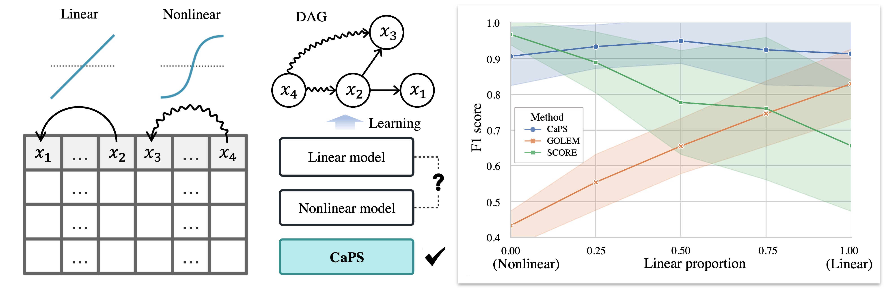

# CaPS
Code and datasets of paper "Ordering-Based Causal Discovery for Linear and Nonlinear Relations". (Accepted by NeurIPS 2024)

Examples of command:

## Get Started
`python3 train_order.py --dataset sachs`

`python3 train_order.py --dataset SynER1 --linear_rate 1.0`